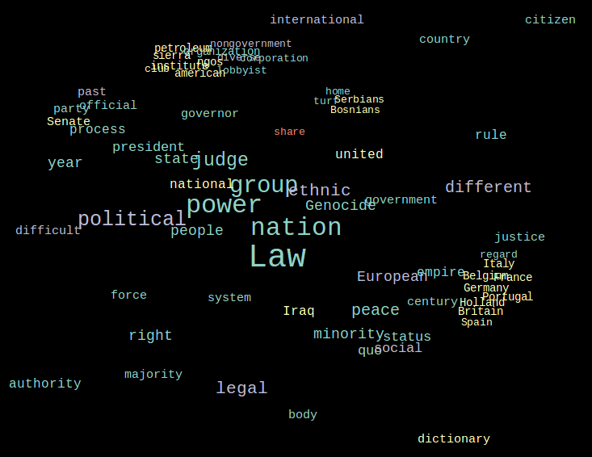
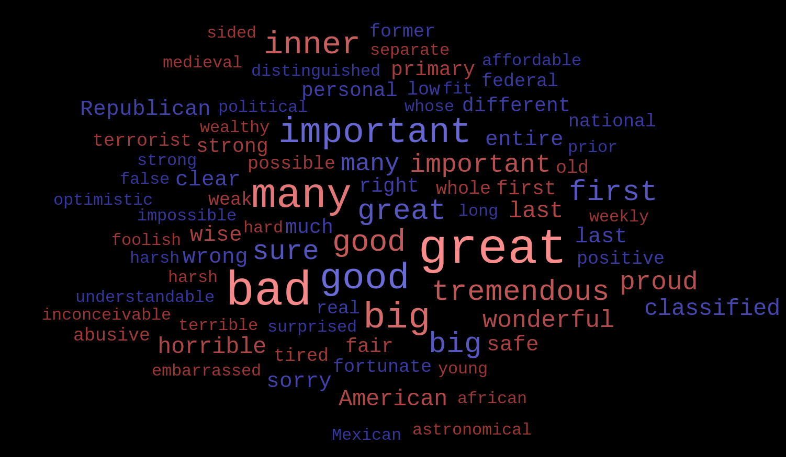
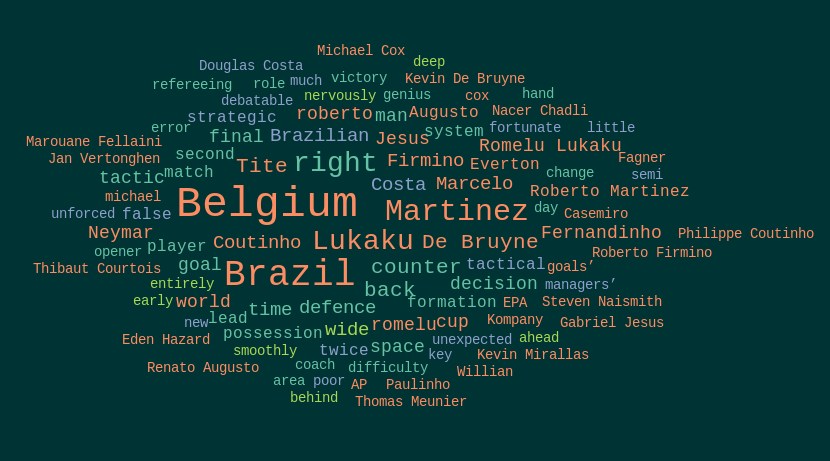
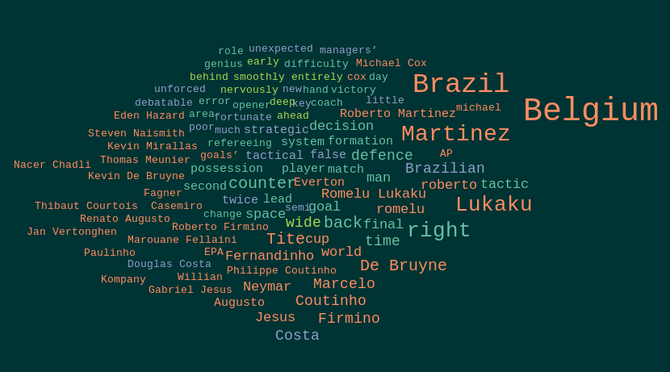

# word-mesh
A wordcloud/wordmesh generator that allows users to extract keywords from text, and create a simple and interpretable wordcloud.


## Why word-mesh?

Most popular open-source wordcloud generators ([word_cloud](https://github.com/amueller/word_cloud), [d3-cloud](https://github.com/jasondavies/d3-cloud), [echarts-wordcloud](https://github.com/ecomfe/echarts-wordcloud)) focus more on the aesthetics of the visualization than on effectively conveying textual features. **word-mesh** strikes a balance between the two and uses the various statistical, semantic and grammatical features of the text to inform visualization parameters.

#### Features:
 - *keyword extraction*: In addition to 'word frequency' based extraction techniques, word-mesh supports graph based methods like **textrank**, **sgrank** and **bestcoverage**.
 
 - *word clustering*: Words can be grouped together on the canvas based on their semantic similarity, co-occurence frequency, and other properties.
 
 - *keyword filtering*: Extracted keywords can be filtered based on their pos tags or whether they are named entities.
 
 - *font colors and font sizes*: These can be set based on the following criteria - word frequency, pos-tags, ranking algorithm score.
 

## How it works?
**word-mesh** uses [spacy](https://spacy.io/)'s pretrained language models to gather textual features, graph based algorithms to extract keywords, [Multidimensional Scaling](https://en.wikipedia.org/wiki/Multidimensional_scaling) to place these keywords on the canvas and a force-directed algorithm to optimize inter-word spacing.


## Examples

Here's a visualization of the force-directed algorithm. The words are extracted using *textrank* from a textbook on international law, and are grouped together on the canvas based on their co-occurrence frequency. The colours indicate the pos tags of the words.




This wordmesh was created from Steve Job's famous commencement speech at Stanford. The keywords are extracted using *textrank* and clustered based on their *scores*. The font colors and font sizes are also a function of the scores. *[Code](examples/examples.ipynb)*


This is from the same text, but the clustering has been done based on *co-occurrence frequency* of keywords. The colors have been assigned using the same criteria used to cluster them. 

This is quite apparent from the positions of the words. You can see the words like 'hungry' and 'foolish' have been grouped together, since they occur close to each other in the text as part of the famous quote **"Stay hungry. Stay foolish"**. *[Code](examples/examples.ipynb)*


This is a wordmesh of all the *adjectives* used in a 2016 US Presidential Debate between Donald Trump and Hillary Clinton. The words are clustered based on their *meaning*, with the font size indicating the usage frequency, and the color corresponding to which candidate used them. *[Code](examples/examples_labelled.ipynb)*




This example is taken from a news article on the Brazil vs Belgium 2018 Russia WC QF. The colors correspond to the *POS tags* of the words. The second figure is the same wordmesh clustered based on the words' *co-occurrence frequency*. *[Code](examples/examples.ipynb)*

 

## Installation

Install the package using pip:

    pip install wordmesh

You would also need to download the following language model (size ~ 115MB):

    python -m spacy download en_core_web_md

This is required for POS tagging and for accessing word vectors. For more information on the download, or for help with the installation, visit [here](https://spacy.io/usage/models).

## Tutorial

All functionality is contained within the 'Wordmesh' class.

```python
from wordmesh import Wordmesh

#Create a Wordmesh object by passing the constructor the text that you wish to summarize
with open('sample.txt', 'r') as f:
    text = f.read()
wm = Wordmesh(text) 

#Save the plot
wm.save_as_html(filename='my-wordmesh.html')
#You can now open it in the browser, and subsequently save it in jpeg format if required

#If you are using a jupyter notebook, you can plot it inline
wm.plot()
```
The Wordmesh object offers 3 'set' methods which can be used to set the fontsize, fontcolor and the clustering criteria. **Check the inline documentation for details**.

```python
wm.set_fontsize(by='scores')
wm.set_fontcolor(by='random')
wm.set_clustering_criteria(by='meaning')
```
   
You can access keywords, pos_tags, keyword scores and other important features of the text. These may be used to set custom visualization parameters.

```python
print(wm.keywords, wm.pos_tags, wm.scores)

#set NOUNs to red and all else to green
f = lambda x: (200,0,0) if (x=='NOUN') else (0,200,0)
colors = list(map(f, wm.pos_tags))

wm.set_fontcolor(custom_colors=colors)
```
    
For more examples check out [this](examples/examples.ipynb) notebook.

If you are working with text which is composed of various labelled sections (e.g. a conversation transcript), the LabelledWordmesh class (which inherits from Wordmesh) can be useful if you wish to treat those sections separately. Check out [this](examples/examples_labelled.ipynb) notebook for an example.

## Notes

- The code isn't optimized to work on large chunks of text. So be wary of the memory usage while processing text with >100,000 characters.
- Currently, [Plotly](https://plot.ly/) is being used as the visualization backend. However, if you wish to use another tool, you can use the positions of the keywords, and the size of their bounding boxes, which are available as Wordmesh object attributes. These can be used to render the words using a tool of your choice.
- As of now, POS based filtering, and multi-gram extraction cannot be done when using graph based extraction algorithms. This is due to some problems with underlying libraries which will hopefully be fixed in the future.
- Even though you have the option of choosing 'TSNE' as the clustering algorithm, I would advise against it since it still needs to be tested thoroughly.
